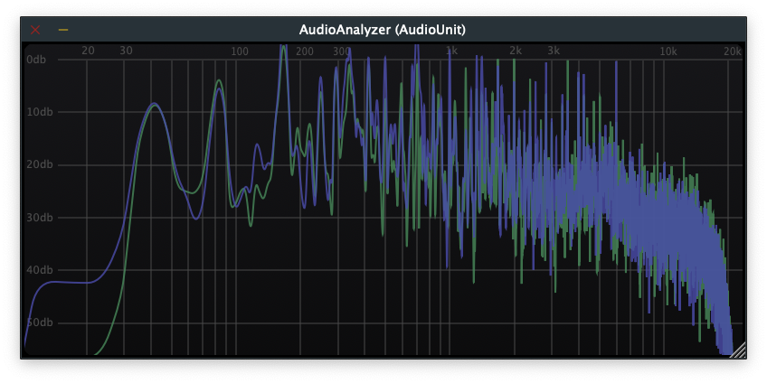
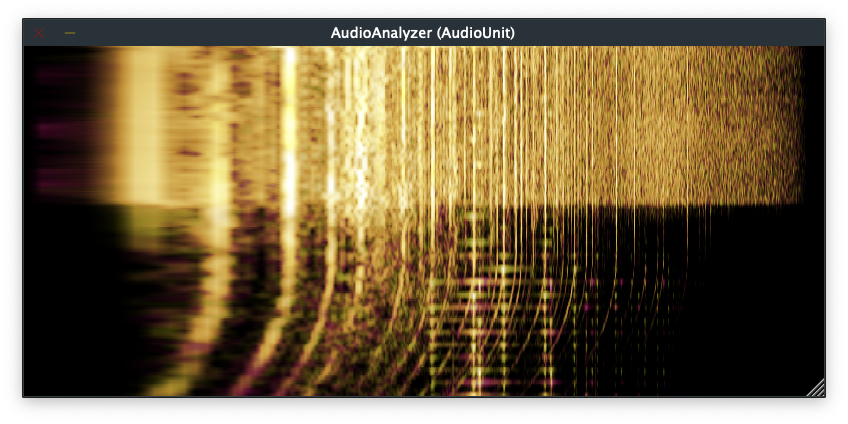
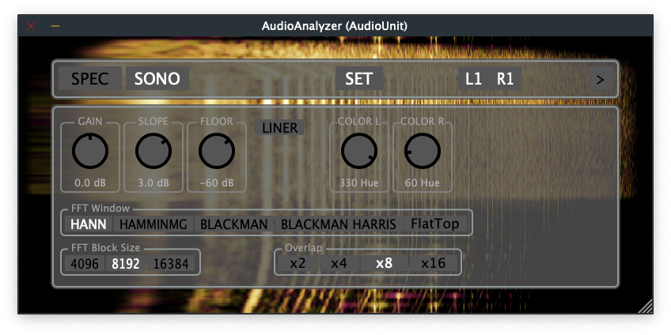

# AudioAnalyzer
VST3 AU LV2 Mac Windows Linux audio analyzer (Spectrogram Sonogram) plugin (JUCE)

## Known Issues
- Sometimes, but very rarely, crushing
- Spectrogram have bad optimization. Use FFT Block Size 4096 and Overlap x2. In future may be fixing.
- Sonorogram recommend use FFT Block Size 8192 and Overlap x16. 
- Use only one plugin instance. More instance crushing.

## Linux Build (Arch Linux)

sudo pacman -S base-devel juce

Launch app "Projucer" and open "AudioAnalyzer.jucer" 

Select exporter "Linux Makefile" and "File -> Save"

cd (download path)/AudioAnalyzer/Builds/LinuxMakefile

make Standalone CONFIG=Release

make VST3 CONFIG=Release

make LV2 CONFIG=Release

make clean (not necessary)

