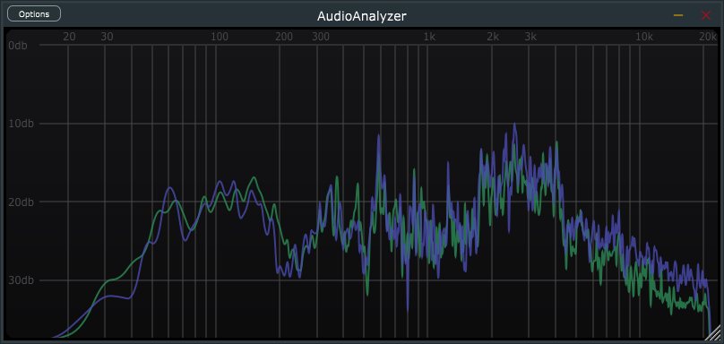
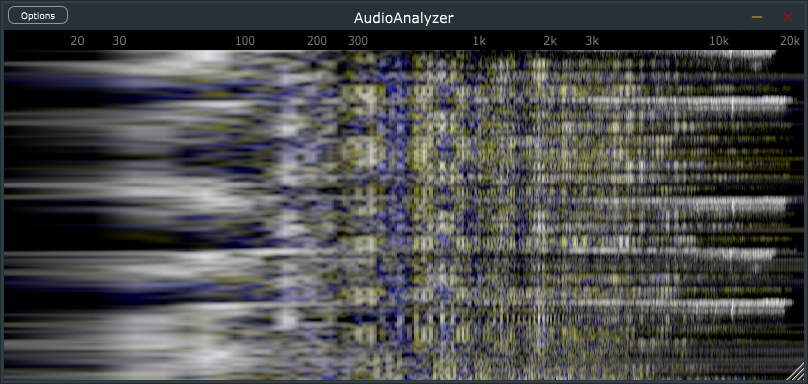
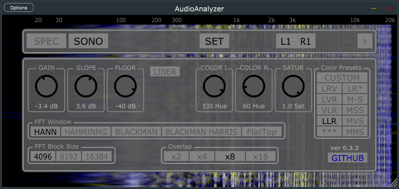

# AudioAnalyzer
VST3 AU LV2 Mac Windows Linux audio analyzer (Spectrogram Sonogram) plugin (use JUCE ver 7.0.12 !!!)

## Known Issues
- For drawing Spectrogram uses tool of framework no really optimization.









## macOS Build 

For mac use 7.0.9 version JUCE!


## Linux Build (Arch Linux)
```
sudo pacman -S base-devel webkit2gtk juce
```
Launch app "Projucer" and open "AudioAnalyzer.jucer" 

Select exporter "Linux Makefile" and "File -> Save"
```
cd (download path)/AudioAnalyzer/Builds/LinuxMakefile

make Standalone CONFIG=Release

make VST3 CONFIG=Release

make LV2 CONFIG=Release

make clean (not necessary)
```
Set audio buffer in you audio server size <= 512


## TODOList
- [ ] optimization draw config menu
- [ ] create setting for bg grid
- [ ] remake routing channel for AU
- [ ] add OpenGL support
- [ ] create osciloscope
- [ ] spectrum add mid/side setting
- [ ] spectrum add AvgTime Max Freeze and Safe Load References
- [ ] spectrum add freq/note view
